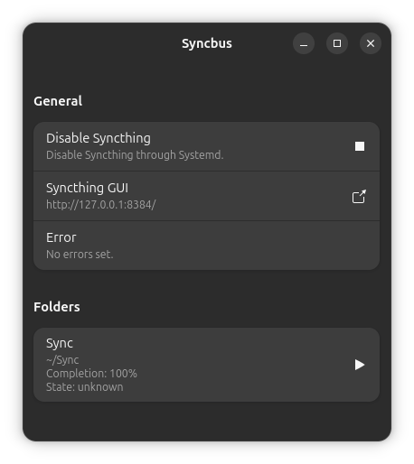

# Phosh Session Services

A set of services to run in Phosh's session

## Syncbus

Syncbus is a D-Bus server for [Syncthing](https://syncthing.net/). It exposes
few functionalities of Syncthing through D-Bus properties and methods.

This server is based on the v2.0.0 of Syncthing [REST API](https://docs.syncthing.net/v2.0.0/dev/rest.html).

### Prerequisites

Syncbus requires a few runtime dependencies.

1. Syncthing must be configured to be available via HTTP API.
2. Systemd with a `syncthing.service` unit to manage Syncthing.

### Getting Started

Syncbus is written in Rust, so it needs standard Rust development setup. Meson
is used as build system to help in configuring files.

First, setup and compile the project.

```sh
$ meson setup build
$ meson compile build
```

Then, run the server `phosh-syncbus`.

```sh
$ build/phosh-syncbus/phosh-syncbus
```

You can use
[`RUST_LOG`](https://docs.rs/env_logger/latest/env_logger/#enabling-logging) to
configure logging. For example, to enable debug logging, use `RUST_LOG=debug`.

```sh
$ RUST_LOG=debug build/phosh-syncbus/phosh-syncbus
```

### Demo

Syncbus comes with a simple demo written in
[Adwaita](https://gnome.pages.gitlab.gnome.org/libadwaita/). It is meant to
demonstrate the different APIs of the server.



The demo can be built by enabling `demo` option on Meson.

```sh
$ meson configure build -Ddemo=true
$ meosn compile -C build
```

As the demo communicates with the D-Bus server, you need to have the server
running before the demo is launched.

```sh
$ build/phosh-syncbus/phosh-syncbus &
$ build/demo/phosh-syncbus-demo
```

### API

Please check [`docs/api.md`](./docs/api.md).

### Service and Interface Files

If `meson install` is used, a few helpful files are installed in the prefix. It
includes D-Bus service and Systemd unit file for Syncbus and D-Bus interface
descriptions of Syncbus.

```sh
$ meson install -C build
$ tree prefix
prefix
├── lib
│   └── x86_64-linux-gnu
│       └── systemd
│           └── user
│               └── phosh-syncbus.service
├── libexec
│   ├── phosh-syncbus
│   └── phosh-syncbus-demo
└── share
    └── dbus-1
        ├── interfaces
        │   ├── mobi.phosh.syncbus.Folder.xml
        │   └── mobi.phosh.syncbus.Manager.xml
        └── services
            └── mobi.phosh.syncbus.service
```

## Phosh OS Updater

phosh-os-updater indicates when new OS updates are available. It uses
`org.freedesktop.sysupdate1` for that.

## Getting in Touch

Please use [`phosh.mobi`](https://matrix.to/#/#phosh:phosh.mobi) Matrix channel
to communicate with the developers.
